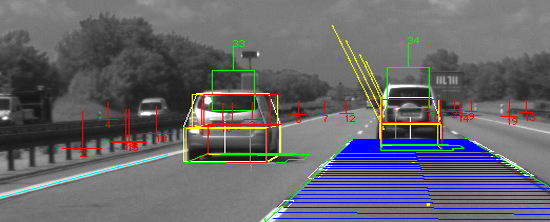

# Computer Vision
## School of Engineering and Applied Science, Ahmedabad Univerisity

### Faculty
Dr. Mehul Raval | [Profile](https://ahduni.edu.in/seas/people/faculty/mehul-s-raval)

## Computer Vision Projects

<h3> Caravana Image Masking Challenge </h3> [Report](./CIMC/CV_Report_CIMC.pdf) | [PPT](./CIMC/CV_PPT_CIMC.pptx)
#### Bhavya Patwa, Deval Shah, Karan Patel, Parth Shah
Caravana an online car startup has provided screenshots of cars present in their inventory and has posed a challenge on Kaggle to automate their masking process (i.e. removing background). Problem occurs where car color matches the background, intensity of light also proves a hindrance here. A classical Image segmentation problem, in the form of live kaggle challenge.

<h3> Video Tagging </h3> [Report](./DBProgrammers/CV_Report_DBProgrammers.pdf) | [PPT](./DBProgrammers/CV_PPT_DBProgrammers.pdf)
#### Varad Bhogayata, Ratnesh Shah, Prerak Raja, Madhav Chavda
Given a facial video recording, the task is to estimate pulse rate using non contact techniques. The concepts include computer vision, facial recognition and detection and signal processing techniques.

<h3> Hand Gesture Recognition </h3> [Report](./TheWildCards/CV_Report_TheWildCards.pdf) | [PPT](./TheWildCards/CV_PPT_TheWildCards.pptx)
#### Akash Soni, Kashish Shah, Raj Shah
This project implements a hand recognition and hand gesture recognition system. A histogram based approach would be used to separate out a hand from the background image. Background cancellation techniques would be used to obtain optimum results. The detected hand is then processed and modelled to recognize finger and palm positions and dimensions. Finally, a gesture object would be created from the recognized pattern which is compared to a defined gesture dictionary.

<h4> Traffic Management using Pattern and Surrounding Analysis </h4> [Report](./Videre/CV_Report_Videre.pdf) | [PPT](./Videre/CV_PPT_Videre.pptx)
#### Aashima Yuthika, Deep Patel, Divya Patel, Maunil Vyas
We are focusing on analysis and consecutively, management, of various traffic conditions by analysing factors in a traffic like, density, motion of the clusters, along with the surroundings. This can help in making predictive analysis of traffic patterns under various circumstances, for example, when an accident has occurred, how does it affect the traffic conditions in the surrounding areas, thus helping in diverting the traffic to a place with less congestion.

<h3> Estimating Pulse Rate using facial video recording </h3> [Report](./JAR/CV_Report_JAR.pdf) | [PPT](./JAR/CV_PPT_JAR.pptx)
#### Aneri Sheth, Janki Desai, Rupande Shastri
Given a facial video recording, the task is to estimate pulse rate using non contact techniques. The concepts include computer vision, facial recognition and detection and signal processing techniques.

```markdown
Syntax highlighted code block

# Header 1
## Header 2
### Header 3

- Bulleted
- List

1. Numbered
2. List

**Bold** and _Italic_ and `Code` text

[Link](url) and 
```

For more details see [GitHub Flavored Markdown](https://guides.github.com/features/mastering-markdown/).

### Jekyll Themes

Your Pages site will use the layout and styles from the Jekyll theme you have selected in your | [Repository settings](https://github.com/burglarhobbit/cvprojects2017/settings). The name of this theme is saved in the Jekyll `_config.yml` configuration file.

### Support or Contact

Having trouble with Pages? Check out our [documentation](https://help.github.com/categories/github-pages-basics/) or [contact support](https://github.com/contact) and we’ll help you sort it out.
